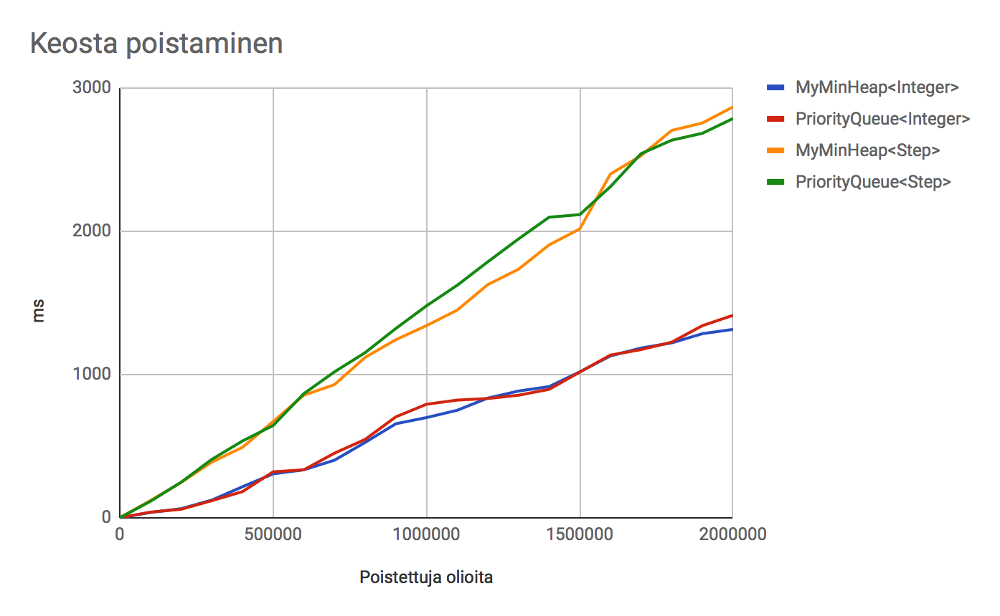

# Testausdokumentti

Ohjelman automaattinen testaus on toteutettu JUnitilla. Testit koostuvat yksittäisten luokkien yksikkötesteistä, hakualgoritmin eri osia tarkastavista, useiden luokkien yhteistoimintaa vaativista testeistä sekä suorituskykyä mittaavista automaattisista testeistä. Niillä luokilla, joilla ei ole sisäistä logiikkaa, ei ole omia erityisiä yksikkötestejä. Tässä dokumentissa käydään läpi lähinnä suorituskykytestauksen tuloksia.

# Hakualgoritmit

Keräilevän reitinhaun suorituskyvyn testaamiseen käytetään satunnaisesti generoituja luolastoja. Tällöin luolastoon luodaan tyhjiä ruutuja, seiniä ja energiasolmuja (joita on n. 5%) sekä valmis reitti, jolla varmistetaan, että luolastolla on ratkaisu. Vaikeammissa luolastoissa energiasolmut eivät ole suoraan reitillä, minkä johdosta reitistä tulee mutkikkaampi. Automaattisissa JUnit-testeissä satunnaisia luolastoja käytetään helppojen luolastojen testaamiseen, jolloin algoritmi käyttää siemenlukua. 

Hiukan yllättävää oli, että jo pienillä luolastoilla tavallinen Forager-haku alkaa jumiutua: satunnaisgeneroiduissa luolastoissa jo 30 x 30 luolasto (noin 50 energiasolmua) saattaa kuluttaa muistin loppuun, jolloin ratkaisua ei siis saada. Myös tehokkaamilla hauilla haun vaativuus kasvaa hyvin nopeasti. 

Kaksivaiheinen haku säästää merkittävästi muistia, ja sen ansiosta haut ovat mahdollisia suuremmissa luolastoissa. Varsinainen haaste ei sinänsä ole itse luolaston koko, vaan energiasolmujen määrä ja keskinäinen sijoittuminen. Kaksivaiheinen haku käyttäen Manhattan-etäisyyttä pystyy ratkaisemaan hyvinkin suuria satunnaisesti generoituja luolastoja, mutta näin on vain silloin, jos niissä on olemassa suorin mahdollinen reitti. Vaikeammissa luolastoissa, joissa suorin reitti ei ole mahdollinen, Manhattan-haulla on mahdollista ratkaista noin 60 x 60 satunnainen luolasto, jossa on ~160 energiasolmua. Tällöin ratkaisun tuottaminen voi venyä kymmeniin sekunteihin. 

### Nopeus vaikeammissa luolastoissa

| Koko  |Energia	| Forager | Phased (no reuse) |PhasedForager|
|:-----:|:-----:	|:------:|:----------:	|:--------:|
|20 x 20| 17    	|	90 ms	| 146 ms		| 142 ms
|30 x 30| 27		|	654 ms	| 164 ms		| 237 ms
|40 x 40|	67		|ei ratkea| 675 ms		| 543 ms
|50 x 50|	113		|ei ratkea| 846 ms		| 501 ms
|60 x 60| 158		|ei ratkea| ei ratkea	| 4828 ms
|70 x 70|	n. 220	|ei ratkea| ei ratkea	| ratkeaa harvoin

### Nopeus helpoissa luolastoissa

| Koko  |Energia	| Forager  |PhasedForager|
|:-----:|:-----:	|:------:	|:----------:	
|20 x 20| 10    	|	2 ms	| 16 ms		
|30 x 30| 28		|	60 ms	| 168 ms		
|40 x 40|	55		| 	395 ms	| 87 ms		
|50 x 50|	90		|ei ratkea| 167 ms	
|75 x 75|	219		|ei ratkea| 363 ms	
|100 x 100| 414	|ei ratkea| 749 ms		
|150 x 150| 980	|ei ratkea| 1449 ms	
|200 x 200|1825	|ei ratkea| 2688 ms
|250 x 250|2907	|ei ratkea| 4553 ms
|300 x 300|4301 	|ei ratkea| ei ratkea

# Tietorakenteet

Tietorakenteiden suorituskykytestit on toteutettu JUnit-testeinä, joissa sama testi toteutetaan useita kertoja, joiden nopeuksista lasketaan keskiarvo. Testiaineisto on osin satunnaisesti generoitua siemenlukua käyttäen.

### MyMinHeap - Minimikeko

Testasin minimikekoa sekä Integer-olioiden että ohjelmassa käytettyjen Step -olioiden kanssa. Testatut metodit olivat lisääminen ja poistaminen listasta. Näistä lisääminen oli selkeästi vähenn raskas operaatio.

MyMinHeapilla osoittautui kokeissa hiukan Javan PriorityQueueta nopeammaksi. Poistaminen ja siitä seuraava Heapify toimii yhtä nopeasti. Step-olioilla molemmat operaatiot hidastuivat selvästi.

### MyArrayList - Dynaaminen lista

Testasin dynaamisen listan lisäys- ja poistometodeja Integer-olioilla. Vertauskappaleena toimi Javan ArrayList. Dynaamiseen listaan lisääminen osoittautui hieman nopeammaksi, oletattavasti siksi, että listan kokoa kasvatetaan harvemmin. 

Listaan poistaminen testattiin lisäämällä listaan kaksi kertaa poistettavien lukujen määrä ja poistamalla indeksit puolesta välistä nollaan. Listasta poistamisen nopeudessa ei ole merkittävää eroa minun toteutukseni ja ArrayListin välillä. Tämä johtunee siitä, että molemmissa raskain operaatio, eli listan siirtäminen poistetun indeksin paikalle, toteutettiin Javan System.arraycopy-metodilla, joka natiivimetodina on nopein tapa listojen siirtoon.

### VisitTree - Tasakorkuinen binäärinen hakupuu

Tasakorkuinen hakupuu on rakennettu erityisesti VisitMap -tietorakenteiden tallentamiseen ja hakemiseen, joten ei ollut mielekästä koettaa testata sitä muilla tietorakenteilla. Testiaineistoksi generoitiin toisistaan poikkeavia VisitMap -olioita, ja erikoissolmulistan pituus (ja siis myös puun korkeus) on testeissä lisättyjen olioiden määrä / 20.

Tasakorkuinen hakupuu osoittautui odotetusti monta kertaa Javan valmista HashSet-adotetustilgoritmia nopeammaksi erityisesti lisäämisen yhteydessä.

